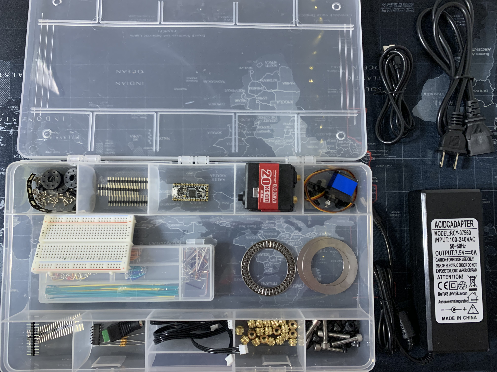
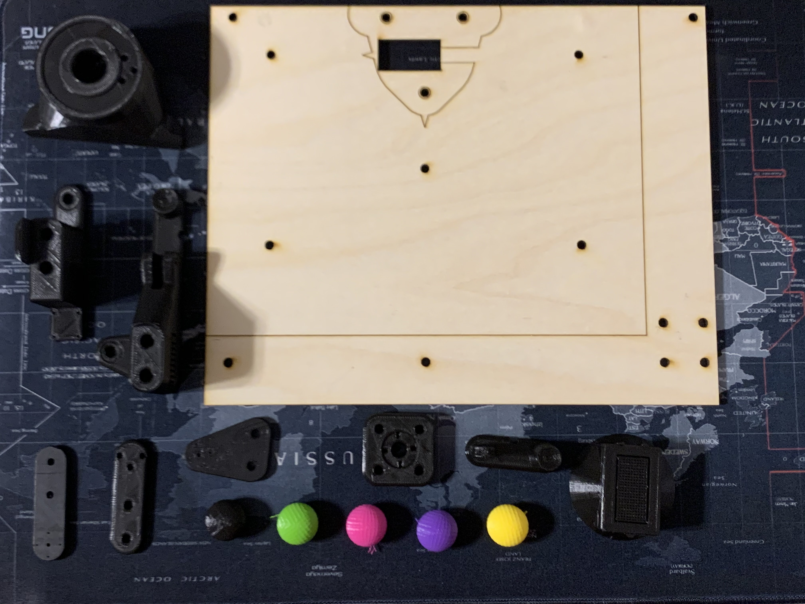
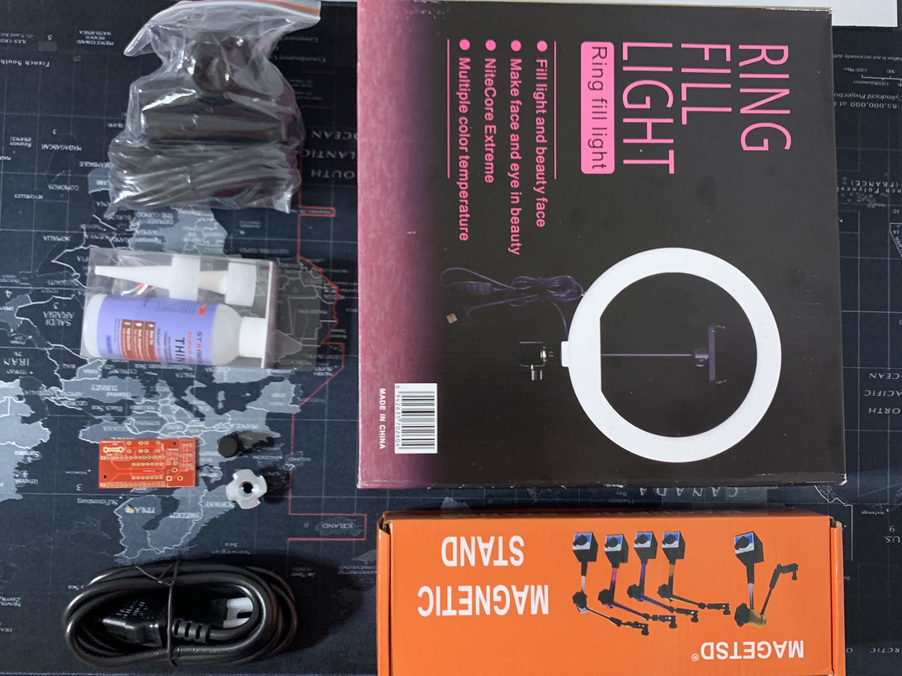

# 1 Hephaestus Arm v2

This robot is for use in RBE 3001 as a teaching platform for robot kinematics and trajectory planning and image recognition. 


## 1.1 READ THIS SECTION BEFORE YOU DO ANYTHING

You need to follow all instructions in this guide **in order**, doing steps out of order means you may need to take apart the robot or risk breaking a component. 

Read through each section completely and then do the actions in the guide. Doing this will make sure you have an understanding of why and what you are doing. 

## 1.2 Dependancies and Tools

### 1.2.1 Linux Install
You need to install Ubuntu 18.04 on your personal computer.

[How to install Ubuntu](ubunutu_install.md)

The rest of the guide assumes you have a base familiarity with the linux terminal and Ubuntu.

If you do not, here are resources to help you get familiar

* [Ubuntu UI Help](https://youtu.be/lmeDvSgN6zY?t=68)
* [Terminal Basics](https://ubuntu.com/tutorials/command-line-for-beginners#1-overview)


### 1.2.2 Required Programs 

Once you have Linux open a terminal (Ctrl+Alt+t) and run the following commands 

```
	sudo apt-key adv --keyserver hkp://keyserver.ubuntu.com:80 --recv-keys 71EA898B 
	sudo apt-get install software-properties-common
	sudo add-apt-repository "deb http://ppa.launchpad.net/mad-hephaestus/commonwealthrobotics/ubuntu bionic main" -y
	sudo apt-get update 
	sudo apt-get install bowlerstudio curl git putty  zip unzip lightdm
	sudo adduser $(whoami) dialout
```

After running the commands above a menu should pop up allowing you to choose between lightdm and gdm3.Choose the lightdm option

If the menu does not pop up run. 
```
sudo dpkg-reconfigure lightdm 
```

Restart your computer and you should see a slightly different login screen when you boot into Ubuntu. 

Doing so will install some programs that you need for later steps, as well as configure your login manager to avoid a known bug with the default one.

The programs installed are
* BowlerStudio 
* Used for design modeling of the robot arm, install drivers, and unit-test hardware, this is for 3d display of the robot
* curl (allows you to get files from the internet)
* git (allows you to access and work with code repositories)
* zip/unzip (allows you to zip and unzip files)
* lightdm (an alternative login manager)

### 1.2.3 Required Tools 

Tools in this section you **will** need to complete the build. If you are missing any of the required tools contact an SA and they may be able to provide workarounds.

Items that start with :wrench: are found in the [Bookstore Tool Kit](https://wpi.bncollege.com/shop/BNCB_TextbookDetailView?displayStoreId=32554&urlRequestType=Base&catalogId=10001&productId=650018123733&langId=-1&partNumber=98_844002999&storeId=32554&sectionId=97501629&item=N).

* [Needle Nose Pliers](https://www.amazon.com/Tools-VISE-GRIP-Pliers-6-Inch-2078216/dp/B000A0OW2M/ref=sr_1_3?dchild=1&keywords=needle+nose+pliers&qid=1598832659&s=industrial&sr=1-3)

* :wrench: [Ph1 Screw Driver](https://www.amazon.com/Wera-05118024001-Kraftform-Electronics-Screwdriver/dp/B0001P18M8/ref=sr_1_3?crid=5UV2I9OLZR1P&dchild=1&keywords=ph1+screwdriver&qid=1598832754&sprefix=ph1+s%2Caps%2C181&sr=8-3)

* :wrench: [Wire Stripper](https://www.pololu.com/product/1923)

* :wrench: [Soldering Iron](https://www.sparkfun.com/products/14456)

* :wrench: [Soldering Stand](https://www.sparkfun.com/products/9477)

* :wrench: [Lead Free Solder](https://www.digikey.com/product-detail/en/aven-tools/17551LF/243-1341-ND/5252791)

* [Double Sided Foam Tape](https://www.amazon.com/Scotch-Mounting-0-75-inch-350-inches-110-LongDC/dp/B009NP1OBC)

* [Wire Kit](https://www.amazon.com/REXQualis-Breadboard-Assorted-Prototyping-Circuits/dp/B081H2JQRV)

### 1.2.4 Useful Tools 

Items that start with :wrench: are found in the [Bookstore Tool Kit](https://wpi.bncollege.com/shop/BNCB_TextbookDetailView?displayStoreId=32554&urlRequestType=Base&catalogId=10001&productId=650018123733&langId=-1&partNumber=98_844002999&storeId=32554&sectionId=97501629&item=N).

Tools in this section you **might** need to complete the build.

* :wrench: [Solder Wick](https://www.sparkfun.com/products/9327)

* [Zipties](https://www.amazon.com/Cable-Nylon-Locking-Pieces-Black/dp/B07VRSQ6YL)

* :wrench: [Digital Multi Meter](https://www.sparkfun.com/products/12966)

* [220 Grit Sandpaper](https://www.amazon.com/Fandeli-36027-Multipurpose-Sandpaper-25-Sheet/dp/B00WSVNHBS/ref=sr_1_2?crid=1YRPC72JKS2L9&dchild=1&keywords=220+sandpaper&qid=1598832549&s=industrial&sprefix=220+s%2Cindustrial%2C169&sr=1-2)

Feel free to source these tools from wherever is nearby and cheap, this is just the first amazon link or what was included in the tools kit. 

# 2 Unboxing and Understanding Your Kit. 

The goal of this section is to give you an understanding of your kit and the parts in it. This section assumes you have purchased the [RBE 3001 Main kit](https://wpi.bncollege.com/shop/BNCB_TextbookDetailView?displayStoreId=32554&urlRequestType=Base&catalogId=10001&productId=650018123743&langId=-1&partNumber=98_844003009&storeId=32554&sectionId=97501637&item=N) and the [RBE 3001 Camera kit](https://wpi.bncollege.com/shop/BNCB_TextbookDetailView?displayStoreId=32554&urlRequestType=Base&catalogId=10001&productId=650018123744&langId=-1&partNumber=98_844003010&storeId=32554&sectionId=97501637&item=N).

## 2.1 RBE 3001 Main Kit




*Note the box in the image is not included get your own. 

1) 3x - [Smart Servo Kit](https://www.amazon.com/dp/B081CTX6DM/ref=twister_B0817ZKWF9): Servo Motor that drives the main 3 joints of the arm,along with a cord and servo horns.

2) 1x - [Power Supply](https://www.digikey.com/product-detail/en/mean-well-usa-inc/GST60A07-P1J/1866-2147-ND/7703710): Provides power to arm, via a DC jack.

3) 1x - [Barrel Jack Adapter](https://www.sparkfun.com/products/10288): A DC jack to covert the power supply to a power and ground terminal.

4) 1x - [Adafruit ItsyBitsy](https://www.adafruit.com/product/3800) : The microcontroller for the arm.

5) 1x - [Line Driver](https://www.digikey.com/product-detail/en/texas-instruments/SN74HC126N/296-8221-5-ND) : An integrated cicuit to help control the servos.

6) 1x - [Breadboard](https://www.sparkfun.com/products/12002) : A board to help organize the circuit.

7) 4x - [10K Ohm Resistor](https://www.digikey.com/product-detail/en/stackpole-electronics-inc/CF14JT10K0/CF14JT10K0CT-ND/1830374) : These are not used in initial assembly of the arm.

8) 1x - [Wire Kit](https://www.amazon.com/MCIGICM-Breadboard-Jumper-Cables-Arduino/dp/B081GMJVPB) : The wires used to connect electrical components.

9) 1x - [USB Cable](https://www.amazon.com/AmazonBasics-Male-Micro-Cable-Black/dp/B0711PVX6Z) : A wire to connect the ItsyBitsy to their computer.

10) 1x - [Double Header Pins](https://www.pololu.com/product/1065) : Pins to connect wires and the ItsyBitsy to the breadboard.

11) 1x - [Thrust Bearing](https://www.mcmaster.com/5909k41) : A ring of bearings for the base joint.

12) 2x - [Thrust Bearing Surface](https://www.mcmaster.com/5909K54-5909K54) : A metal ring to support the thrust bearing.

13) 20x - [Heat-Set Inserts](https://www.mcmaster.com/94180a361) : Threaded inserts for the 3D printed parts (sold in packs of 50).

14) 7x - [M5x25](https://www.mcmaster.com/91292A129-91292A129) : Long bolts to assemble arm (sold in packs of 50).

15) 13x - [M5x12](https://www.mcmaster.com/91290A228) : Short bolts to assemble arm (sold in  pack of 100).

16) 1x - [Gripper Servo](https://www.digikey.com/products/en/motors-solenoids-driver-boards-modules/motors-ac-dc/178?k=mg92b) : A servo to operate the gripper.
   
17) 1x - [Power cord](https://www.digikey.com/product-detail/en/mean-well-usa-inc/YP12-YC12/1866-5006-ND/7707223) : Used to power the arm.

18) 1x - [Header Pins](https://www.pololu.com/product/965) : Soldered to the ItsyBitsy.

*Note if you did not purchace the camera kit you will need to buy a [button](https://www.digikey.com/products/en?mpart=367&v=1528 ) to assemble the robot. Or if you are approved to go on campus you can get one from the Foisie lab. 


### 3D Printed Parts



1) 1x - Base: The arm's base

2) 1x - Link 3 Bracket: The middle link of the arm

3) 1x - Main Gripper Body: The main part of the gripper mechanism

4) 1x - Gripper Claw: The mobile part of the gripper

5) 1x - Link 1 Output Bracket: The part of the base joint that will rotate

6) 1x - Link 3 Output Bracket: The panel to hold the smart servo at the gripper's base

7) 1x - Camera Stand Base: A part to mount a threaded stand to the board

8) 1x - Board: A wooden board to mount the arm

9) 1x - Link 2 Output Bracket: A bar with five holes to mount a servo horn

10) 1x - 3 Hole Bar: A bar with three holes for holding a servo

11) 5x - Orb: Pink, yellow, purple, green, and black colored orbs


## 2.2 RBE 3001 Camera Kit



## Camera Kit v1

1) 1x - [PSEye Camera](https://www.amazon.com/Sony-Station-Camera-Packaging-PlayStation-3/dp/B0735KNH2X/) : USB camera to enable image processing.

2) 1x - [Adjustable Stand](https://www.amazon.com/Magnetic-Adjustable-Indicator-Holder-Digital/dp/B00L5T2ZA8/) : A stand to set the height of the camera.

3) 1x - [CA Glue](https://www.amazon.com/Starbond-Cyanoacrylate-Microtips-Woodturning-Stabilizing/dp/B00C32ME6G/) : Super glue to attach some components.

4) 1x - [Ring Light](https://www.newegg.com/p/0SW-01GA-00025?Item=9SIAK0NAUS4868&Tpk=9SIAK0NAUS4868) : Light to ring camera to ensure consistant lighting of the workspace.

5) 1x - [Nut Insert](https://www.mcmaster.com/98965A410) : For mounting camera stand.

6) 1x - [Button](https://www.digikey.com/products/en?mpart=367&v=1528 ) : Meant to be in main kit, used as a microcontroller input (sold in pack of 20).

7) 1x - PCB: A custom PCB that could be used, but the required components are not included in the kit.

8) 1x - Power Cord : Not needed for assembly

## Camera Kit v2
(Not the camera kit provided to students for A20)

1) 1x - [Small Ring Light](https://www.adafruit.com/product/1643) : Smaller alternative to the ring light in camera kit v1.

# 3 Build the electronics

This next step of instructions will guide you in assembeling the elctronics for the arm and then calibrating the servos.

[Wire the electronics](electronics.md)

# 4 Build the arm

[Build instructions](assembly.md)

# 5 Calibrating the arm

 

 

From now on, all you need to do to calibrate the arm is move the robot to the calibrate pose and hit the calibration button on the breadboard. **You will need to  calibrate the robot every time the ItsyBitsy is power cycled.** 

## 6 Matlab Setup

[Setup Matlab and begin working](https://github.com/Hephaestus-Arm/RBE3001_Matlab)

# 7 Extras

## 7.1 Communication

[Communication Protocol](protocol.md)

## 7.2 CAD and simulation

Open BowlerStudio, in the menu

```
Add device -> creatures -> Hephaestus Arm V2
```


This will generate the CAD and run the simulation. 

## 7.3 STL's 

[Current Release Printable STL's](https://github.com/Hephaestus-Arm/HephaestusArm2/releases/download/0.1.0/release-0.1.0.zip)

Print these with supports everywhere, do not reorent the parts. They are printed in this orientation to increase operating strength.

# 8 Troubleshooting

[See the troubleshooting guide](troubleshooting.md)
