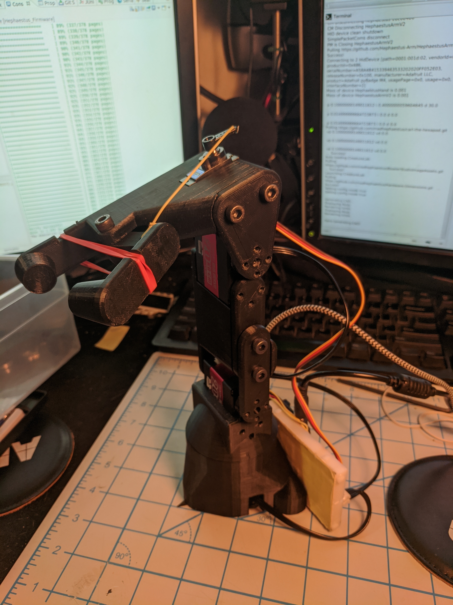
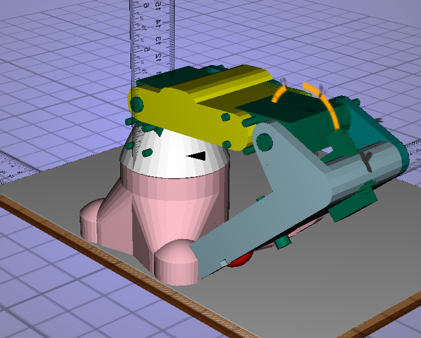
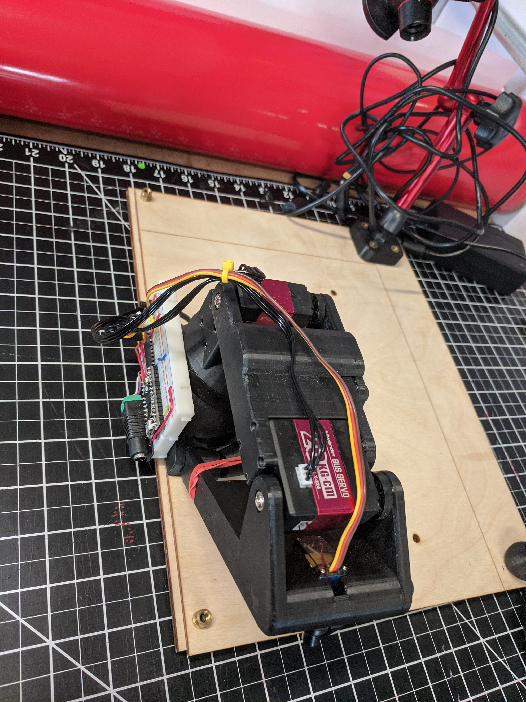

# 1 Hephaestus Arm v2

This robot is for use in RBE 3001 as a teaching platform for robot kinematics and trajecttory planning and image recognition. 




## 1.1 depenancies and tools

* A PC running Ubuntu 18.04 linux
* [BowlerStudio](https://commonwealthrobotics.com/) installed from the PPA or the .deb (this provides the USB driver)
* Putty
* [Matlab Installed using your WPI login](https://github.com/Hephaestus-Arm/RBE3001_Matlab)
* Access to tools listed here: https://github.com/WPIRoboticsEngineering/ZenRobotBuildKit#tools-kit-online-only-suggested
* Git


## Optional

* [Sloeber to compile firmware](https://github.com/WPIRoboticsEngineering/RobotInterfaceBoard/blob/master/InstallEclipse.md#linux-bundled-sloeber)


# 2 CAD and simulation

Open BowlerStudio, in the menu

```
Add device -> creatures -> from git
```
and enter
```
https://github.com/Hephaestus-Arm/HephaestusArm2.git
```
then select
```
hephaestus.xml 
```

This will generate the CAD and run the simulation. 

## STL's 

[Current Release Printable STL's](https://github.com/Hephaestus-Arm/HephaestusArm2/releases/download/0.1.0/release-0.1.0.zip)

print with supports everywhere, do not reorent parts. 

# 3 Build the electronics

[Wire the electronics](electronics.md)

# 4 Build the arm

[Build instructions](assembly.md)

# 5 Calibrating the arm

 

 

From now on, all you need to do to calibrate is move the robot to the home pose and hit the calibration button on the controller. You will need to home the robot each time the Microcontroller is power cycled. 

# 6 Communication

[Communication Protocol](protocol.md)

# 7 Matlab Setup

[Setup Matlab and begin working](https://github.com/Hephaestus-Arm/RBE3001_Matlab)

# 8 Bill Of Materials

## Main Kit:

3x motor https://www.amazon.com/dp/B081CTX6DM/ref=twister_B0817ZKWF9

```NO Engineering substitutions here```

1x power supply: https://www.digikey.com/product-detail/en/mean-well-usa-inc/GST60A07-P1J/1866-2147-ND/7703710

```Engineering substitutions for cost ok here```

1x Barrel Jack adapter: https://www.sparkfun.com/products/10288

```Engineering substitutions for cost ok here```

1x Adafruit ItsyBitsy https://www.adafruit.com/product/3800

```NO Engineering substitutions here```

1x Line Driver: https://www.digikey.com/product-detail/en/texas-instruments/SN74HC126N/296-8221-5-ND

```Engineering substitutions for cost ok here```


1x Breadboard https://www.sparkfun.com/products/12002

```Engineering substitutions for cost ok here```

4x resistors https://www.digikey.com/product-detail/en/stackpole-electronics-inc/CF14JT10K0/CF14JT10K0CT-ND/1830374

```Engineering substitutions for cost ok here```

1x Wire kit: https://www.amazon.com/MCIGICM-Breadboard-Jumper-Cables-Arduino/dp/B081GMJVPB

```Engineering substitutions for cost ok here```

1x USB cable https://www.amazon.com/AmazonBasics-Male-Micro-Cable-Black/dp/B0711PVX6Z

```Engineering substitutions for cost ok here```


1x pin headers https://www.pololu.com/product/1065

```Engineering substitutions for cost ok here```

1x Thrust bearing: https://www.mcmaster.com/5909k41

```Engineering substitutions for cost ok here```

2x Thrust bearing surface:  https://www.mcmaster.com/5909K54-5909K54

```Engineering substitutions for cost ok here```

12x inserts https://www.mcmaster.com/94180a361 (sold in packs of 50)

```Engineering substitutions for cost ok here```

3x M5x25 https://www.mcmaster.com/91292A129-91292A129 (sold in packs of 50)

```Engineering substitutions for cost ok here```

13x M5x12 https://www.mcmaster.com/91290A228 (sold in  pack of 100)

```Engineering substitutions for cost ok here```

1x Gripper servo  https://www.digikey.com/products/en/motors-solenoids-driver-boards-modules/motors-ac-dc/178?k=mg92b

   ```These are much cheaper in bulk from https://www.alibaba.com/product-detail/MG92B-Digital-Metal-Gear-Servo-For_60765301994.html ```
   
2x Button (comes in 20 pack for $2.50) https://www.digikey.com/products/en?mpart=367&v=1528 

1x Power cord https://www.digikey.com/product-detail/en/mean-well-usa-inc/YP12-YC12/1866-5006-ND/7707223

## Camera Kit

1x PSEye camera https://www.amazon.com/Sony-Station-Camera-Packaging-PlayStation-3/dp/B0735KNH2X/

```NO Engineering substitutions here, sourcing is flexible```

1x Adjustable stand https://www.amazon.com/Magnetic-Adjustable-Indicator-Holder-Digital/dp/B00L5T2ZA8/

```If its possible to source something without the base, just the M8 threaded end, that would be even better if cheaper```

1x CA glue https://www.amazon.com/Starbond-Cyanoacrylate-Microtips-Woodturning-Stabilizing/dp/B00C32ME6G/

  ``` Any small super glue is fine here```

1x Ring light https://www.newegg.com/p/0SW-01GA-00025?Item=9SIAK0NAUS4868&Tpk=9SIAK0NAUS4868
  
  ```Sourcing a cheaper one is also good```

1 x nut for mounting camera stand https://www.mcmaster.com/98965A410

