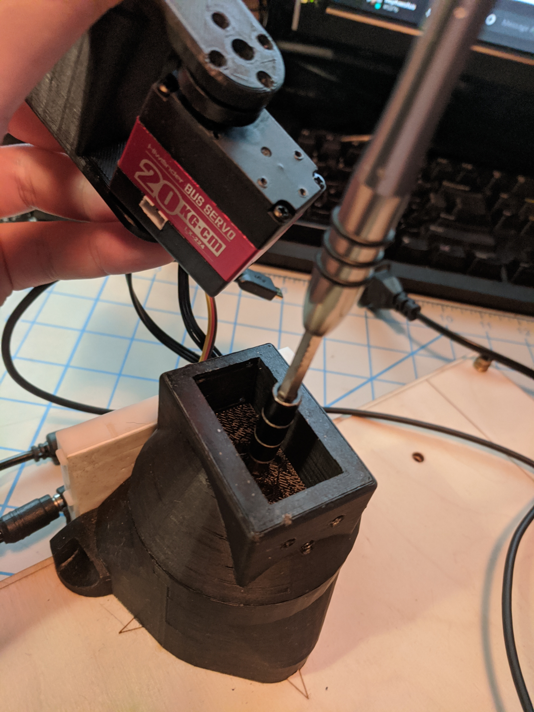
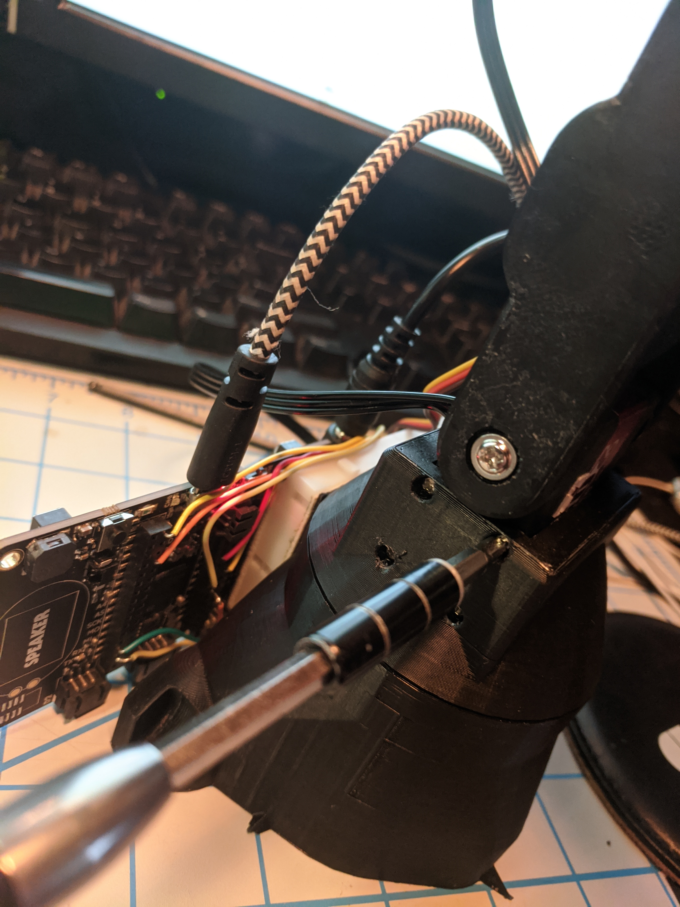

# Assemble the robot

## 1 Build the electronics first

[Wire the electronics](electronics.md)

## 2 clean support material

# 3 Add threaded inserts

ONLY hammer the M8 tee nut for the camera stand.

Use the soldering iron for the rest.

# 4 add horn to link 1 output bracket

the splined horn is used, the idle horn is not used at all. 

# 5 Add horn to the two other link brackets

# 6 Add motor 1 to base

Put the cable in before putting motor into base

# 7 Add motor 3 to middle bracket 

# 8 Add gripper and servo

# 9 Attach Electronics to Base

Remove the backing of the breadboard and use the double stick tape to attach the breadboard to the base

# 10 Wire all Motors and Calibrate them

# 11 Add the thrust bearing to base and link 1 output bracket

# 12 Add passive support screws to Middle bracket and Gripper bracket

Use the supplied screw to attach the printed links to the passive side of the motor.

# 13 Use Calibration Pose to assemble base motor to its horn

Place motor 2 in link 1 output bracket but dont add the screws yet. 

# 14 Pull motor 2 out and add the horn screw

# 15 Add Motor 2 back in and add Motor 2 horn and bracket

# 16 Attach horn to Motor 3

# 17 Calibrate the robot to verify the horn

 Calibrate the robot in its calibration pose now that all motors are in place. 

## 17.1 If the motors move after calibration

If the robot  Calibrates and holds the calibration pose then you are safe to move on. If one of the motors comes off the calibrtation pose, pull that horn and reset it closer to the correct pose, if you have to err to one side go past the calibration pose away from where the motor moved itself. Return to step 17.

## 17.2 Else Add the horn screw to Motor 1

Pull motor 2 out of its slot and add the horn screw to Motor 1

# 18 Add last 2 motor horn screws

# 19 Add motor case screws to motor 2

# 20 Calibrate the gripper

Plug in the gripper servo and power up the system

The gripper will power up fully open place the horn on as shown

also add the rubber band.

Use solid core wire to hold the gripper open in the toggle pose

