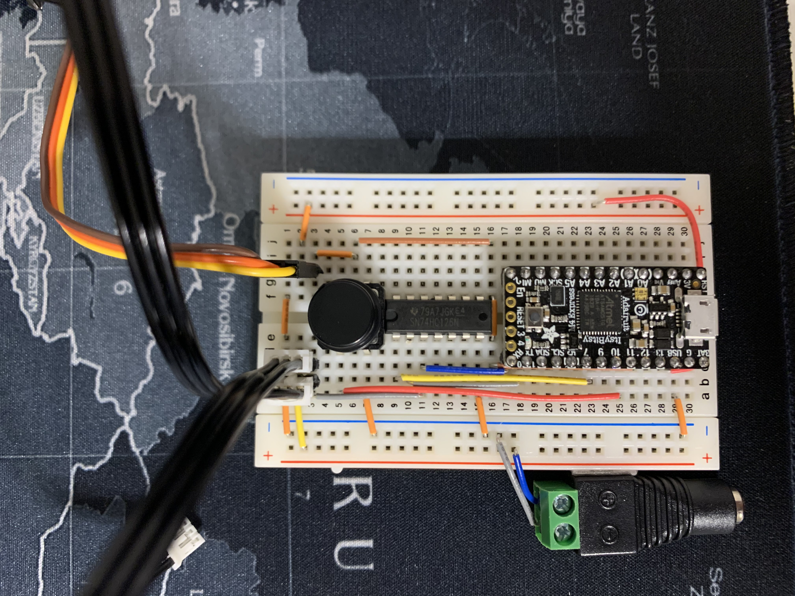
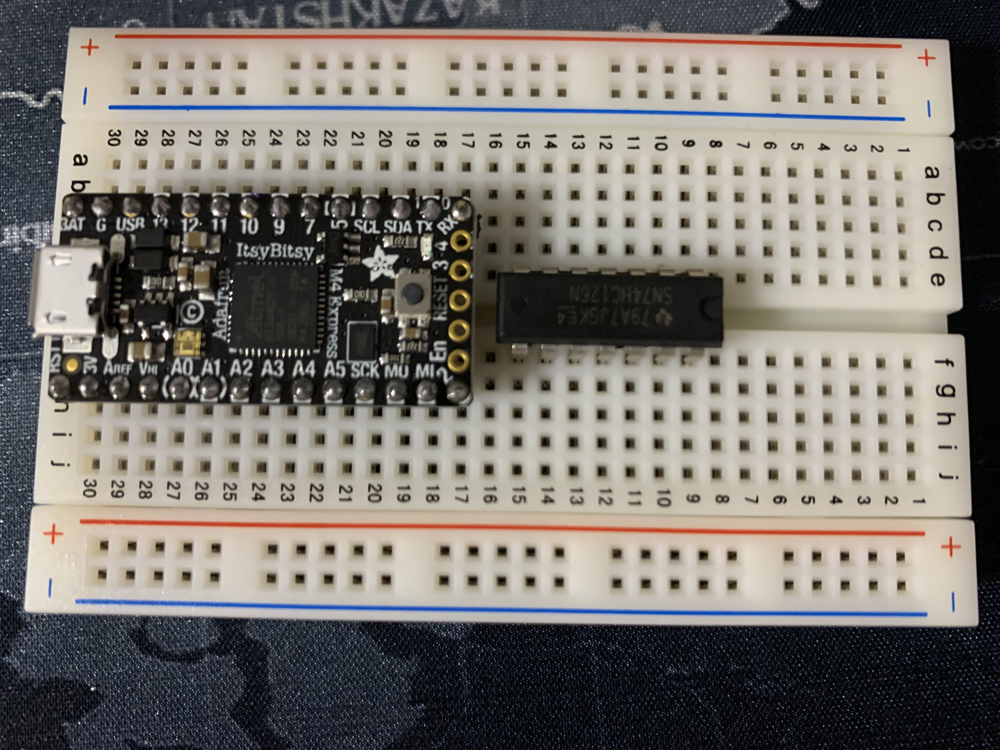
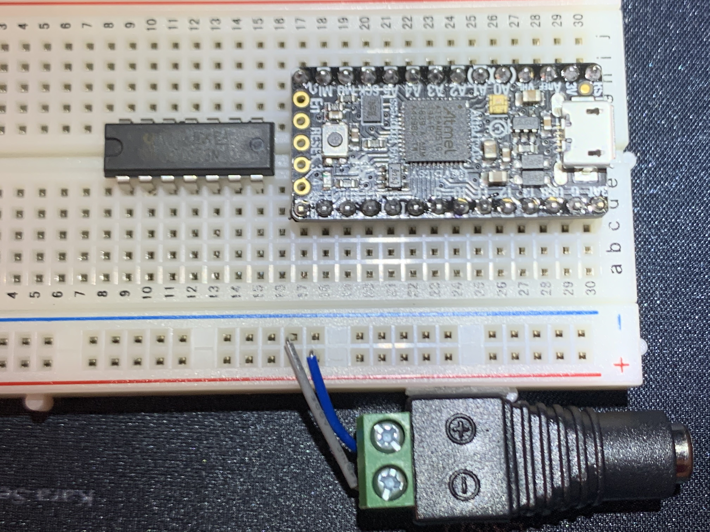
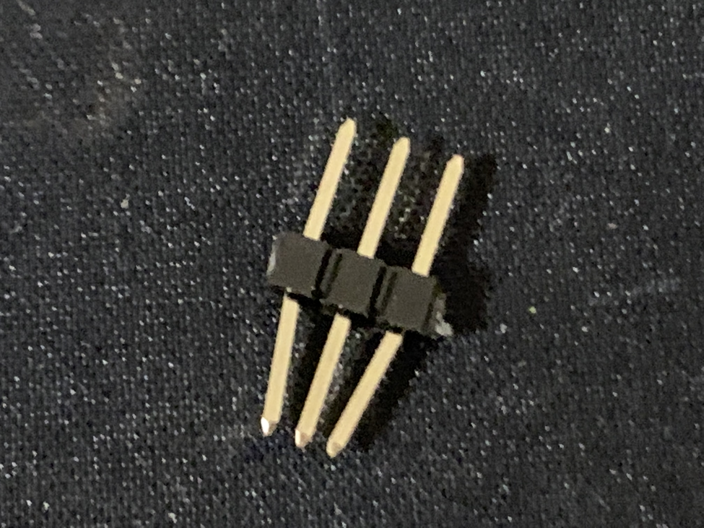
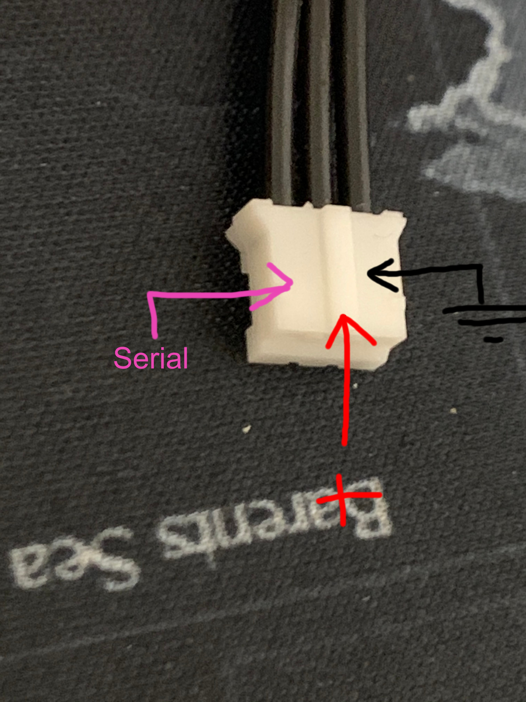
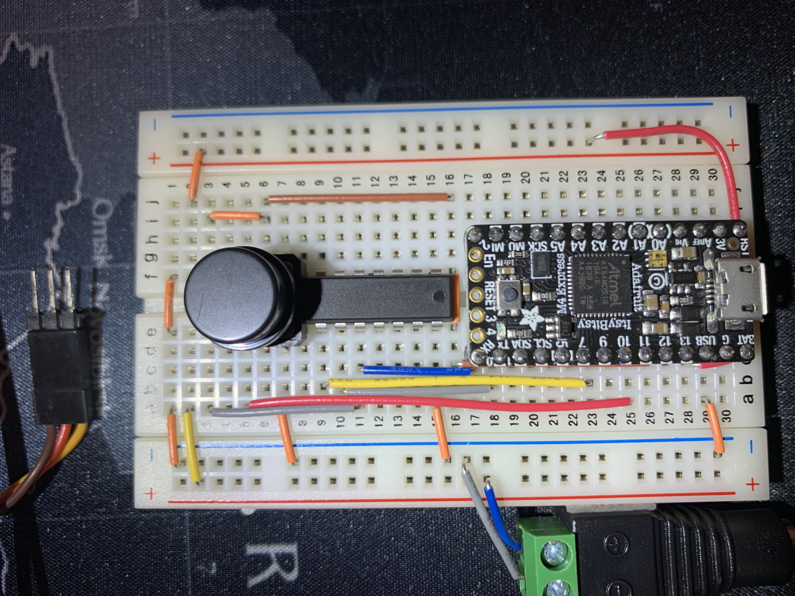
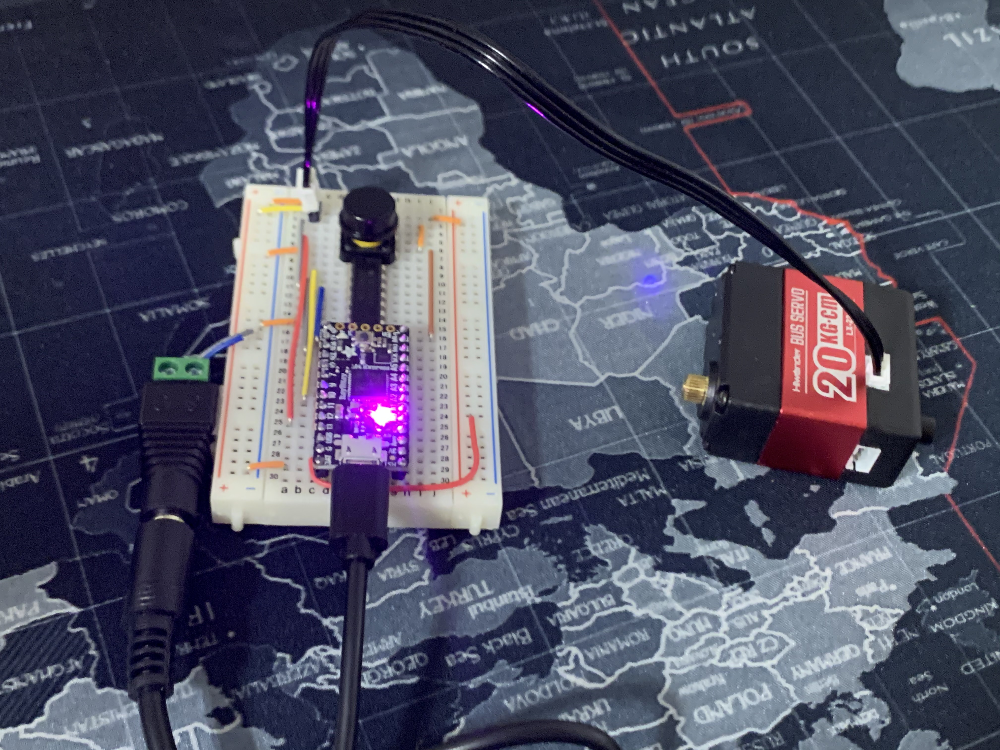
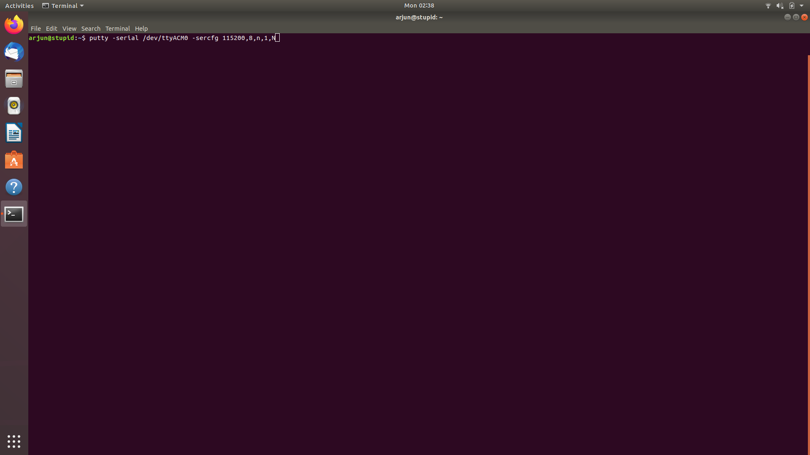
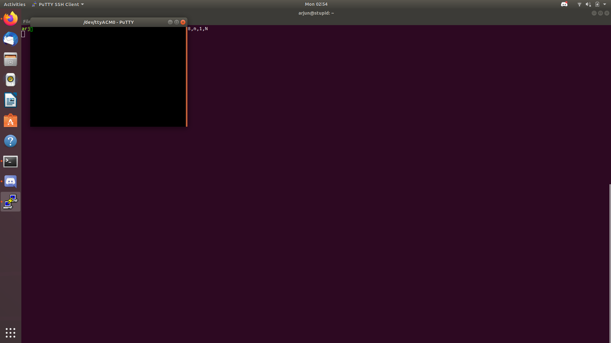
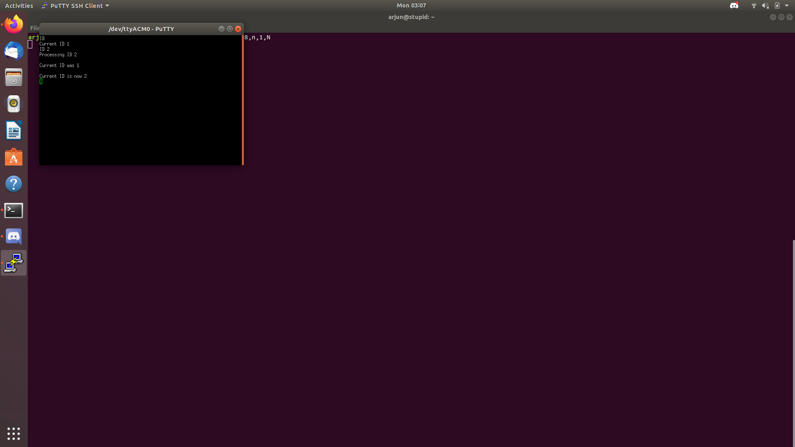

# Electronics Instructions



# 0 Setup

Before starting on this section you will need to have a working ubuntu partition and all software installed on the initial [readme](README.md), as well as all the required tools mentioned there as well.

## 0.1 Learn to Solder

If you do not know how to solder watch the video below on how to solder electrical components.

[](https://www.youtube.com/watch?v=FWBCbFPXJLg)


# 1 Install Firmware to the ItsyBitsy

The goal of this section is to flash the needed firmware onto the Adafruit ItsyBitsy.

## 1.1 Firmware Download 

In order to run the robot we will be using the [source code](https://github.com/Hephaestus-Arm/HephaestusArm2-firmware/) provided by the lab.

However you do not need to download or compile this code we have already done that for you. 

To get the pre-complied code, visit [here](https://github.com/Hephaestus-Arm/HephaestusArm2-firmware/releases) and download the lastest version of 

```
CURRENT.UF2
```

## 1.2 Firmware Program

In order to program the ItsyBitsy we will be using Adafruits Flashdrive Emulation.

**Installing The Firmware**

1. Plug in the ItsyBitsy to your computer using the micro-usb cable in your kit.


2. Open up 2 File Explorer Windows on Ubuntu.


3. Navigate to the download location of the firmware in one window (Probably your `Downloads` Folder).
    

4. *Double Click* the reset button on the ItsyBitsy. This will put it in bootloader mode. The ItsyBitsy should disappear momentarily and then show up as `ITSYM4BOOT`.
    

5. Open ITSYM4BOOT in the other window and drag `Current.UF2` into it. 
    


6. A replace file nofication will show up click the green replace button. 

    

    The ItsyBitsy should then disconnect and not reappear

Congrats! You've flashed the firmware on the ItsyBitsy!

Go ahead and disconnect it from your computer. 
## 1.3 Troubleshooting

If you see

```
curcuitpython
```

as the flash drive name instead of

```
ItsyM4Boot
```

then *DOUBLE CLICK* the reset button on the ItsyBitsy. 

## 2 Setting Up the Board


1. Solder header pins onto the ItsyBitsy with headers and place it in the breadboard. Note you only need to solder pins to the long sides of the board don't worry about the back. See pic below for more reference.

```
Protip: a pair of pliers makes snapping the correct number of header pins much easier.
```


2. Find the 74hc126 line driver and place it in the breadboard.



3. Use the double stick tape to attach the barrel jack adapter to the side of the breadboard. 

```
Protip: Apply pressure to the taped objects for at least 30 seconds to ensure a good bond. Cut your tape to exact sizes to ensure neatness.
```

Then wire the barrel jack termianls to their respective rails on the breadboard.



4. Wiring up the Smart Servo Cables

In order to connect the smart servo cables to the breadboard we need to use the double header pins. Take three double header pins and insert them into the smart servo cable.

*Note, you will need to bend the outer pins going into the servo cable a little in order to make it fit. See below pic made using pliers for reference.




Repeat the above for one side of all 3 servo cables.


5. Pinning up the gripper servo

Use a set of 3 double header pins to add pins to the end of the gripper servo wire.


6. Wire up the breadboard following the diagram below and keep mind the following useful information


```
In the below diagram you can have multiple smart servo wires lined up on the breadboard, all wired to the same ports
```


**LX-224 Pinout**



**Gripper Server Pinout**

Brown = Ground

Red   = 5v from USB

Yellow = Servo Pulse




Congragualtions you've wired up the board. Get Ready to move on to the next step of provisioning the motors. 


## 5 Provision Motor IDs

This section shows how to individually identify the smart servos to the ItsyBitsy's firmware. 

### Understanding the Smart Servo Communication. 

While wiring you probably noticed that all 3 motors got the same signal, power and ground. The smart servo cables can be used to connect multiple smart servos to each other in a chain and still maintain individual functionality, provided they have been provisioned. (Think similar to I2C) However due to wire size chaining more than two smart servos together is not reccomended.


### 5.1 Setting up the Breadboard for Provisioning

While provisioning motors we cannot have multiple motors connects, so remove all connected motors except for one, then plug in the barrel jack power connector and finally plug the usb cable into your computer. 




After plugging in the wire click the reset button on the itsybitsy *ONE* time. You should see a small red led (next to the reset button) flash slowly (on for a second then off for a second). 
```
Protip: during the process or now your red led on your itsybitsy might go from a slow flash to a solid red or turn off. If this happens reset your board by hitting the reset button. 
```

### 5.2 Start Putty

Open a terminal window and type the following command
:

```
putty -serial /dev/ttyACM0 -sercfg 115200,8,n,1,N
```

```
Protip: The command will not work unless all power cables are plugged in and led is slow blinking.
Protip: your itsybitsy may not be on the /dev/ttyACM0 port, if you try to run the putty command and the above conditions are met and you still get an error, then go down to the Extras section 7.3 for a tutorial on how to find which port to use. Scroll back up and continue from here after. 
```

If the command runs successfully a black black window will pop up. This is a serial monitor to that allows us to read and send serial data to the itsybitsy


Inorder to verify communication is working type ID in the window and you should get an reply that looks similar to below.




### 5.3 Setting Motor Provisions

In order to provision the motors we need to use the `ID` command, it is a very simple command that has two modes typing 

```
ID 
```


will return the ID of the current motor that is plugged in

```
ID Command Output (pic)

```

and typing 

```
ID X
```

will set the ID of the current motor to X (X being a number). 

```
ID X Command Output again (pic)
```



Go ahead and provision the Smart servos with ID's 1,2, and 3. 

```
Protip: You might need to reset the board between unplugging one servo and plugging in the next. 
Protip: Having a sharpie or any other way of marking the motors is useful to avoid confusion during assembely.
```

After provisioning you can plug in already provioned motors and check them with the ID command. 

If all your motors keep their ID's congrats you have successfuly provisoned all 3 motors. Now onto calibration.


## 6 Calibrate before beginning assembly

Calibrating the motors is an important step, while these servos are continous, they only have 240 degrees of sensing. This means that your motors can be in a position after assembely where they may not be able to be controlled across their entire range. In order to fix this we try to calibrate the motors and check if they are able to reach their entire measurable range before assembly.

To calibrate. 

1. Plug in all 3 motors and reboot the firmware. 

2. Open up putty using the same command as you did earlier.

3. Press and hold the calibrate button 10 seconeds then let go. The motors should calibrate and move to a calibrated position. If successful you should see the lines:

```
Starting the motor motion after calibration

Starting the planner 
```

on the putty terminal. If this is not what you see contact an SA or Kevin. 


If you have made this far congrats you now have successfuly built a control board, provisioned your motors and calibrated them. Be careful not to turn the output shaft of the servos during the assembly. 

Head back to the [main instructions](README.md) to continue with physcial assembly!

 ## 7 Extras
 
 ### 7.1 Datasheets

[74hc126 Datasheet](https://www.ti.com/lit/ds/symlink/sn74hc126.pdf?HQS=TI-null-null-digikeymode-df-pf-null-wwe&ts=1597341911818)

### 7.2 Text-based pinout of the board

ItsyBitsy GPIO-12 to Servo Pulse
 
ItsyBitsy GPIO-1  to 74hc126 A (see datasheet)

ItsyBitsy GPIO-0  to LX-224 Serial Pin

ItsyBitsy GPIO-9  to 74HC126 OE

74HC126 Y         to LX-224 Serial Pin

ItsyBitsy GPIO-11 to  Calibrate Switch pin 1

Calibrate Switch pin 2 to Ground

74HC126 Power to 3.3v

Connect all grounds

Barrel Jack 7.5v to LX-224 Power

### 7.3 Finding which port the ItsyBitsy is on. 

Running the following command below will tell you each usb connected to your computer replace `/dev/ttyACM0` in the putty with the port you found from running the command.

```
for sysdevpath in $(find /sys/bus/usb/devices/usb*/ -name dev); do
    (
        syspath="${sysdevpath%/dev}"
        devname="$(udevadm info -q name -p $syspath)"
        [[ "$devname" == "bus/"* ]] && exit
        eval "$(udevadm info -q property --export -p $syspath)"
        [[ -z "$ID_SERIAL" ]] && exit
        echo "/dev/$devname - $ID_SERIAL"
    )
done
```
