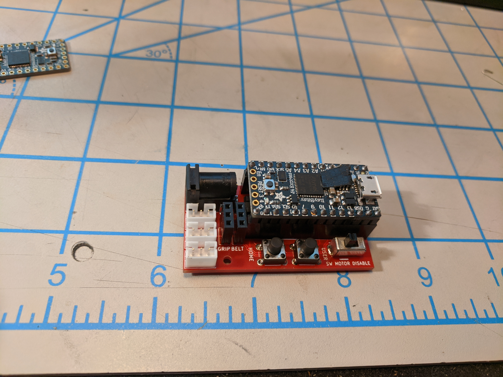
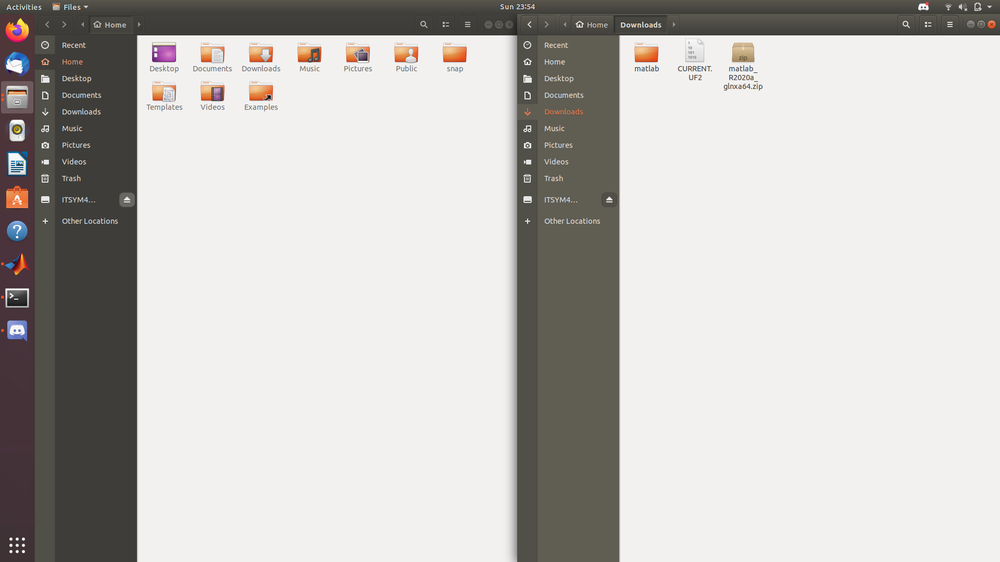
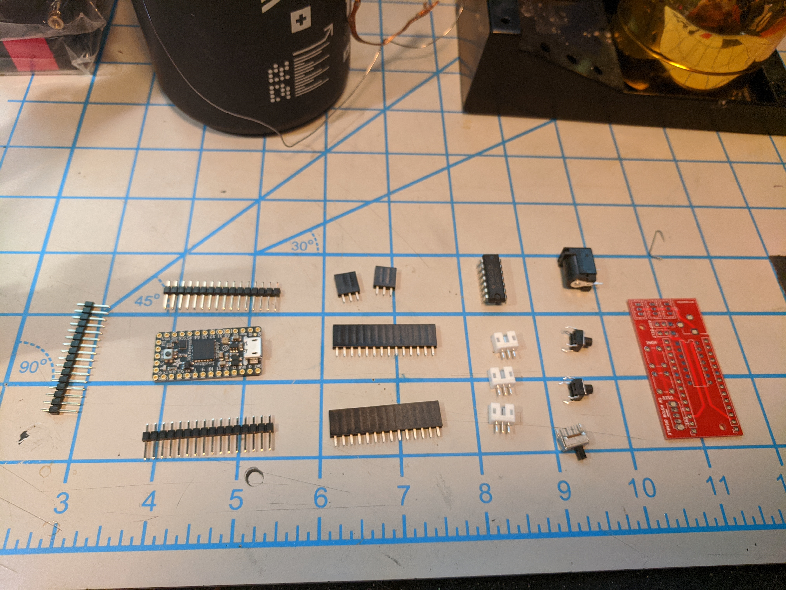
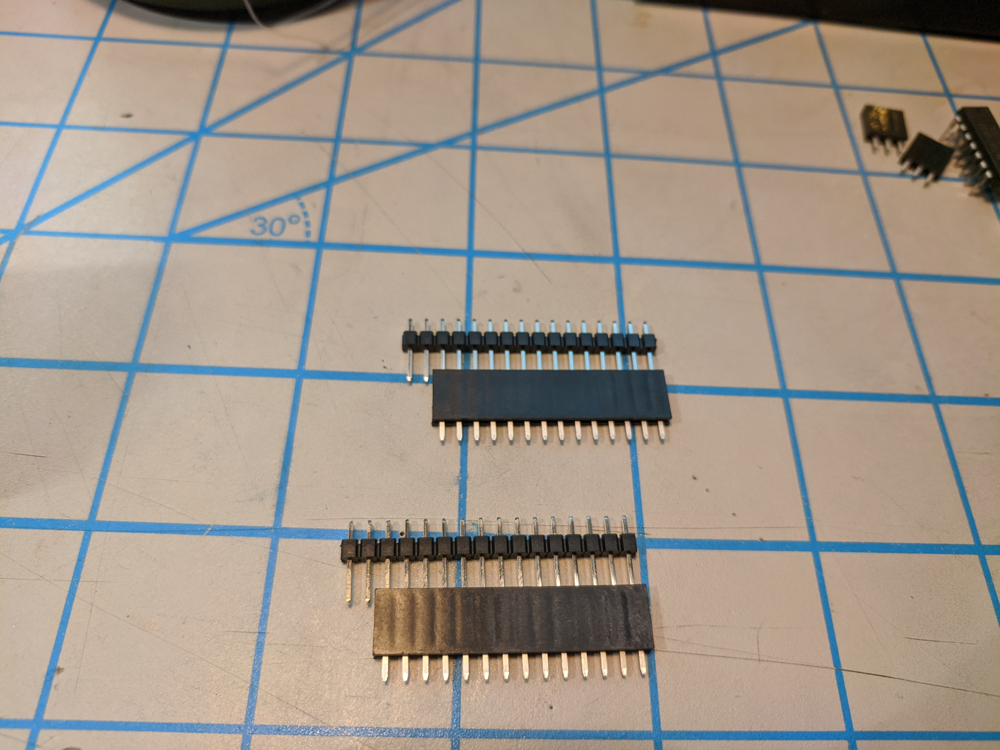
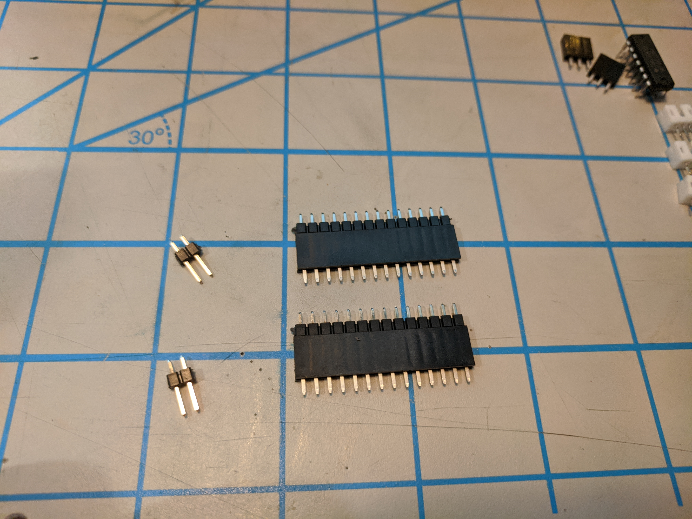
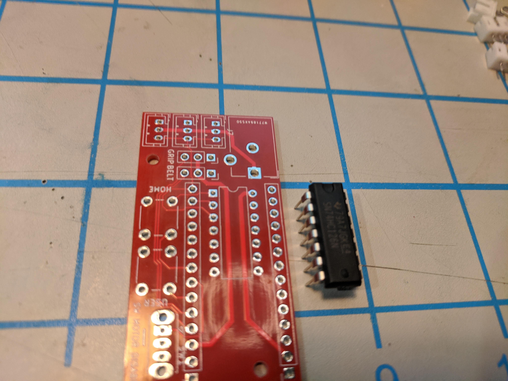
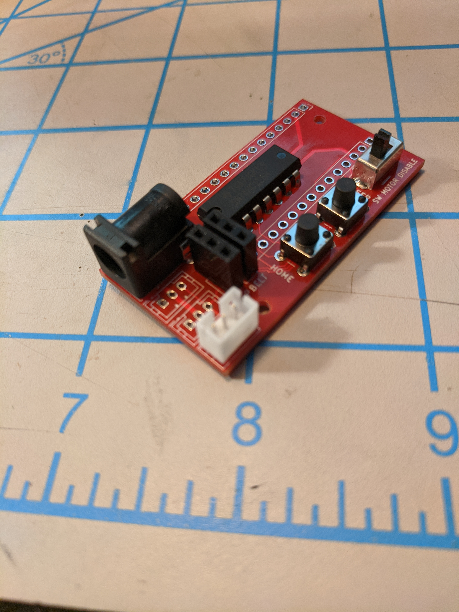

# Electronics Instructions



# 0 Setup

Before starting on this section you will need to have a working ubuntu partition and all software installed on the initial [readme](README.md), as well as all the required tools mentioned there as well.

## 0.1 Learn to Solder

If you do not know how to solder watch the video below on how to solder electrical components.

[](https://www.youtube.com/watch?v=FWBCbFPXJLg)


# 1 Install Firmware to the ItsyBitsy

The goal of this section is to flash the needed firmware onto the Adafruit ItsyBitsy.

## 1.1 Firmware Download 

In order to run the robot we will be using the [source code](https://github.com/Hephaestus-Arm/HephaestusArm2-firmware/) provided by the lab.

However you do not need to download or compile this code we have already done that for you. 

To get the pre-complied code, visit [here](https://github.com/Hephaestus-Arm/HephaestusArm2-firmware/releases) and download the lastest version of 

```
CURRENT.UF2
```

## 1.2 Firmware Program

In order to program the ItsyBitsy we will be using Adafruits Flashdrive Emulation.

**Installing The Firmware**

1. Plug in the ItsyBitsy to your computer using the micro-usb cable in your kit.


2. Open up 2 File Explorer Windows on Ubuntu.


3. Navigate to the download location of the firmware in one window (Probably your `Downloads` Folder).
    

4. *Double Click* the reset button on the ItsyBitsy. This will put it in bootloader mode. The ItsyBitsy should disappear momentarily and then show up as `ITSYM4BOOT`.<br/>
    

5. Open ITSYM4BOOT in the other window and drag `Current.UF2` into it. 
    


6. A replace file nofication will show up click the green replace button. 

    

    The ItsyBitsy should then disconnect and not reappear

Congrats! You've flashed the firmware on the ItsyBitsy!

Go ahead and disconnect it from your computer. 
## 1.3 Troubleshooting

If you see

```
curcuitpython
```

as the flash drive name instead of

```
ItsyM4Boot
```

then *DOUBLE CLICK* the reset button on the ItsyBitsy. 

## 2 Setting Up the Board


1. Solder header pins onto the ItsyBitsy with headers and place it in the breadboard. Note you only need to solder pins to the long sides of the board don't worry about the back. See pic below for more reference.

```
Protip: a pair of pliers makes snapping the correct number of header pins much easier.
```


## 3 Solder up the HephaestusBrain board











