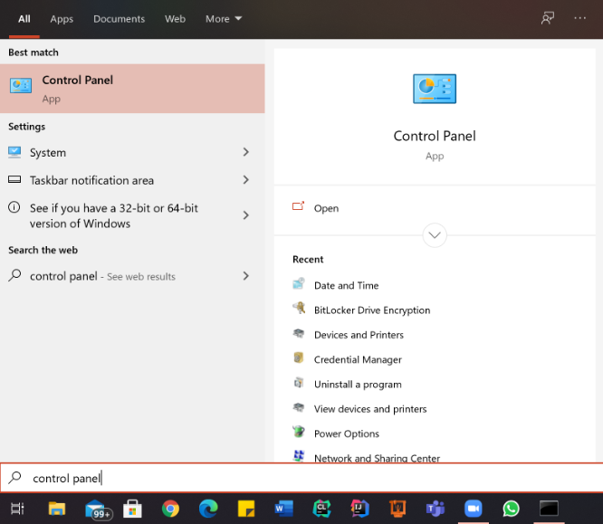
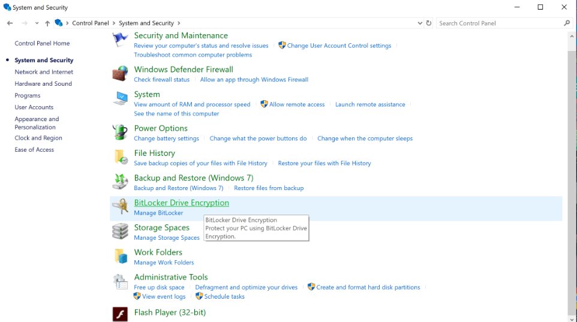
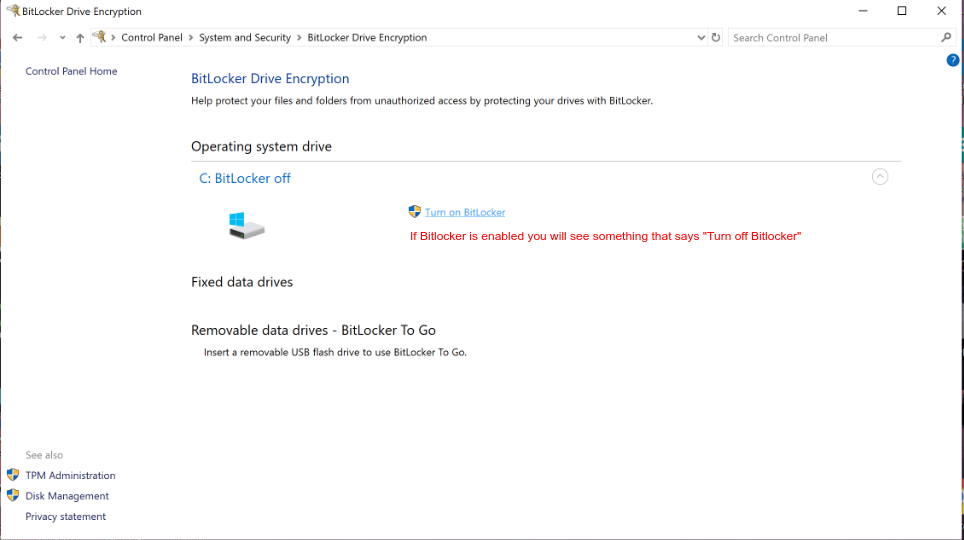
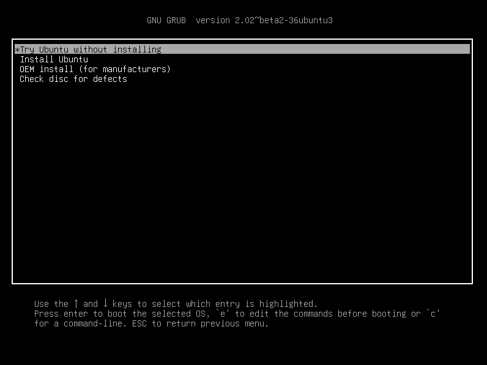
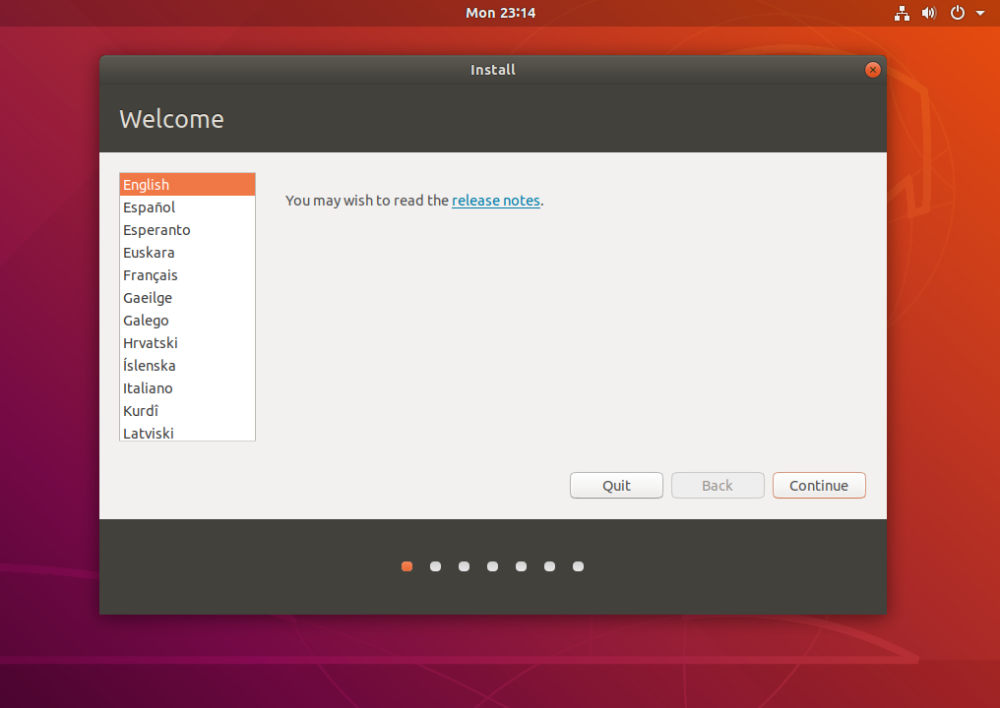
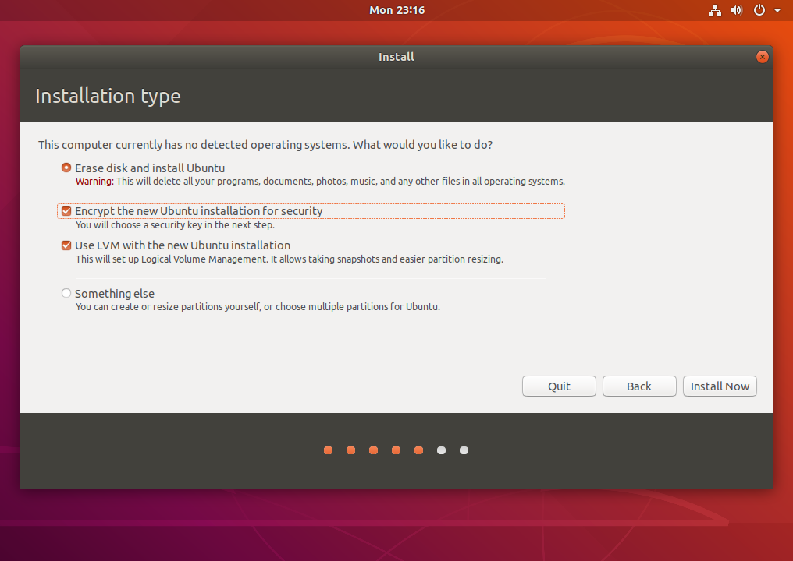
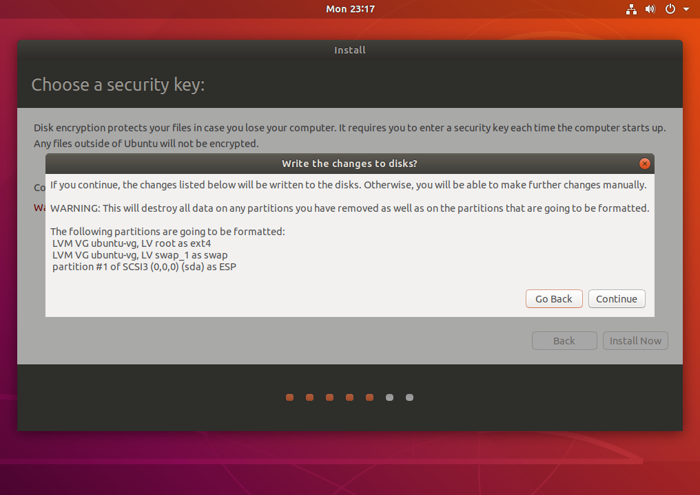
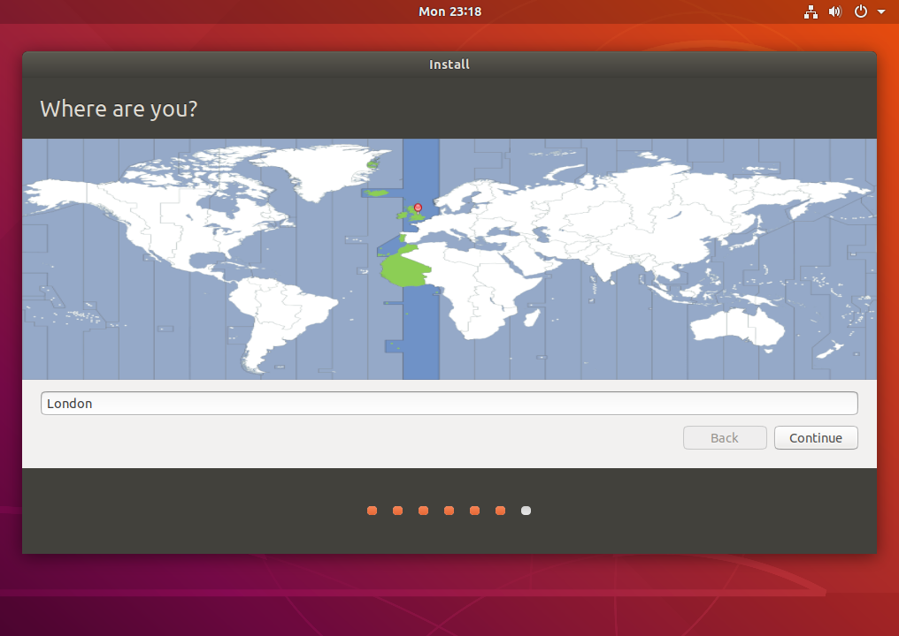
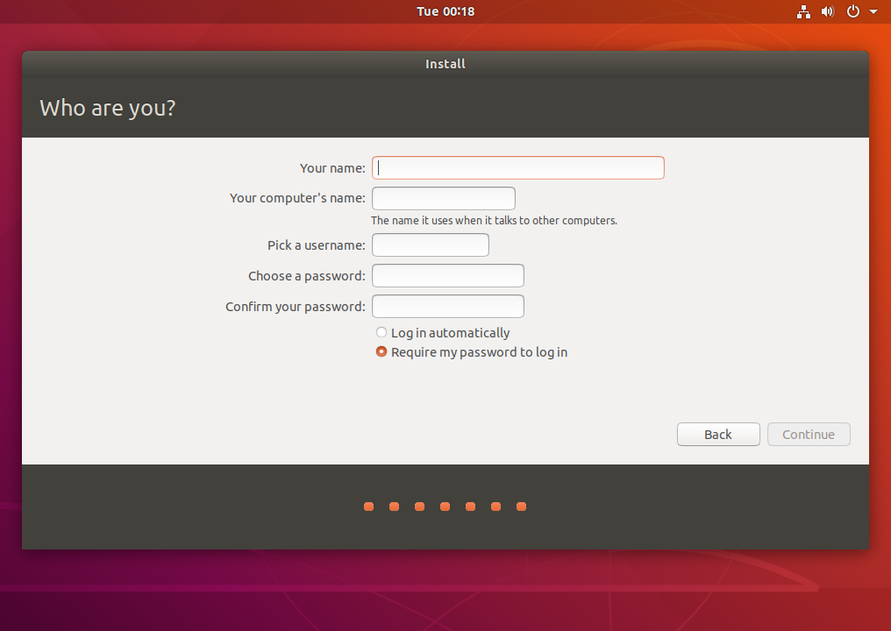

This guide is specifically on how to get from Linux to Windows.

Note if you're concerned about this feel free to reach out to an SA come in during our office hours or reach out to Arjun and Cooper on the rbe discord server for non office hour help. 

If you have questions reference the FAQ below.

## Step 0 
Regardless of what computer you have, theres a couple things we need to do. 

### Backup your data.
We will be messing with your drive and your bios. There's is a chance stuff goes wrong and if it does you will lose everything. If you care about whats on your laptop. **Back. It. Up.**

This is your only warning.

### BitLocker

Bit Locker is Microsofts way of keeping you "safe". Basically its a program will lock down your hard drive and encrypt all the data if it notices something other than Windows modifying either the drive or the bios.* (We will be doing at least one probably both). 

*If you get bitlockered, reach out to Arjun or Cooper we *might* be able to help you.

Thankfully we can disable the program. 

#### Turning off Bit Locker
If you want to decrypt your hard drive, all you need to do is turn off BitLocker. To turn off BitLocker you must be logged into windows as an administrator.

1. Click **Start** , click **Control Panel**, click **System and Security** (if the control panel items are listed by category), and then click **BitLocker Drive Encryption**.

If bitlocker does not show up here then your verison of windows does not have it and you can skip this step.

2. In the **BitLocker Drive Encryption** control panel, click **Turn Off BitLocker**.

If you dont see a **Turn Off BitLocker** then congrats BitLocker is already off.

3. Click **Decrypt Drive** to start the decryption process. This process will take a while.

### Space on your hard drive. 
You need atleast 30gb of free space on your hard drive, Idealy 50gb+, (personsally I split my dualboots down the middle half windows half linux). Backing up all your data means you should be able to get rid of some of the old stuff.  

## Creating a Bootable USB

A bootable usb is a flash drive that you can put an operating system on and then use to load a live enviroment on your computer. 

Follow [this](https://ubuntu.com/tutorials/create-a-usb-stick-on-windows#1-overview) tutorial by Ubuntu. It goes over flash drive selection installing needed programs and anything else you might need. 

Download [this](https://releases.ubuntu.com/18.04.5/ubuntu-18.04.5-desktop-amd64.iso) .iso file to put on your flash drive.

## Using the Bootable USB

The first step to install Ubuntu is to run the Ubuntu live environment. To run the Ubuntu live environment, we have to reboot our PC and load the boot-up menu. 

This procedure varies per model of laptop and the best way to find out what the procedure for your specific machine is to google `how to boot from usb <your machine make and model>`*

*Note you might need to disable something called Secure Boot but that should be evident in your googling

When you are successful in choosing a device to boot off you should see a screen that looks like this. 

Select The **Install Ubuntu** Option to being the install process

## Installing Linux on your hard drive
1.
    Once Ubuntu has booted, you will be presented with a screen that looks like this.

    

    Click Continue to begin the installer. You can open the installer again later if you choose to try it out, but remember it will be far slower running from a Disc/USB than had you installed it, and nothing you do will actually be saved.

2. 
    Choose your Keyboard Layout
    This is probably the most technical step in the installation, made a lot simpler by the Detect Keyboard Layout. Just click that and follow the instructions on screen.

    

3. 
    I reccomend doing a minimal install here, it cuts down on the install size, time and bloatware. and genenrally you'll end up using something other than Ubuntu's native software for most things anyway.

    If you have internet connected go ahead and select install 3rd party software for graphics and wifi

    
   
4. 
    Yours will probably look a little different to mine here. My hard drive doesn't have anything on it yet, so I can choose either to use the whole disk, or specify partitions manually (surprisingly easy stuff). Yours may have a slightly different first option, and one or two extra.

    It may say Delete Windows and Install Ubuntu and Shrink Windows and Install Ubuntu Alongside.

    If you want to do a fresh clean install of Ubuntu choose either `Erase Disk and Install Ubuntu` or `Delete Windows and Install Ubuntu` (bestest)

    If you would like to **Dual Boot** install of Ubuntu choose `Install Ubuntu Alongside.` you will then be brought to a menu to select the size of each partition (not bestest2)

    *you do not need to encrypt the disk or use LVM, I just stole this photo off the internet.

    

5. 
    Confirm your Choice

    

    After clicking continue, you may be presented with a confirmation screen, much like this, to confirm your choices.

    Click Continue to begin installing.

    You'll be asked a few more questions in a second about where you are, what your name is, and how you want your computer set up. These are for time settings, user names, and home folders.
6. 
    Choose your Location

    

    Now you get to choose your location by dropping a pin on this nifty looking map. This is to select your timezone and apply any regional adjustments.

7. 
    Set a Username and Password
    Now you get to enter your name, the name you want your computer to be (not really important), your username (again, you won't see this much, but it can't have capitals or spaces, best leave as it is made from your real name), a password (if you want, then confirm it, and keep it strong), whether or not to log in automatically, and whether or not to encrypt your home folder (which is where documents, music, and video folder can be found, among others).

    

    I would not recommend encrypting your home folder, as this usually complicates things for you as much as any potential trespassers. It can lead to complications with keyrings, forgotten passwords, and bad data recovery. Only use if it is a company policy, or you thoroughly understand what you are doing. Also, only set your password to nothing if you are unlikely to ever want one, otherwise yet more compilations with keyrings and automatic unlocking-on-login can arise.

8. 
    Wait for the Install to finish. 

    Once its done restart the computer, unplug the usb drive and you should be greeted by a grub menu that will allow you to boot into either Ubuntu or Windows. (or just Ubuntu if you aren't dual booting)
    

## FAQ

Q: How do I connect to WPI wireless networks  
A: Follow this guide from ITS https://hub.wpi.edu/article/403/connect-to-wpi-wireless-on-ubuntu

Q: Can I use a VM?   
A: No. The communication protocal the arm uses requires it to be run on "bare metal" anything else will be too slow. 

Q: Can I use the Ubuntu subsystem for Winodws (WSL)?   
A: No for the same protocal reasons as above. Also why. 

Q: I don't have enough space on my computer to install Ubuntu   
A: It's 50gb to install ubuntu, do your best to backup and remove old files, photos, etc.
There are hundreds of services out there to do this for almost nothing. 

Below are the services I use.  
* [AWS S3 backup guide](https://aws.amazon.com/getting-started/hands-on/backup-files-to-amazon-s3/)
* [Google Photos](https://photos.google.com/)
* [Github](https://github.com/)

However worse come to worst you *can* run it on an external hard drive but it'll be slow and it's a nightmare to setup

Q: Can I use Ubuntu 20.04  
A: Theoretically yes, however lab staff will all be running on 18.04, and 20.04 is untested. 

